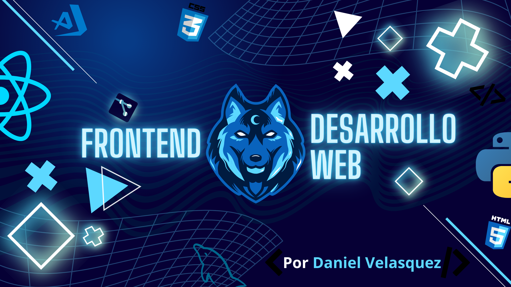

  #  Hola👋 soy Daniel

  

:octocat: Portafolio: https://github.com/Darkniel117/Portafolio

📧 Correo: Danield-117@outlook.com

<!--
## Sobre mi
- 🎓 Actualmente soy estudiante del programa Tecnico en programacion de Software en el SENA.
- 💻 Soy un entusiasta del diseño web y programacion.

## Tecnologias
Aunque me encuentro en una etapa temprana de mi carrera, he tenido la oportunidad de adquirir algunos conocimientos en tecnologias como 
HTML, CSS, JavaScript, MySQL y MongoDB; las cuales practico dia a dia con algunos proyectos propios y de otras personas.

- 🌱 Actualmente estoy aprendiendo y fortaleciendo mis conocimientos en HTML, CSS, JavaScrit, GIT Y GITHUB, bases de datos MySQL y eventualmente 
pienso iniciar a aprender mas tecnologias a fines como frameworks y lo necesario para ser competente laboralmente.

## Proyectos de practica
1. https://github.com/Darkniel117/Rick-Morty
2. https://github.com/Darkniel117/proyecto
3. https://github.com/Darkniel117/ejercicios

-->
